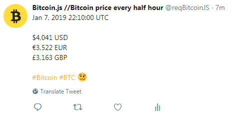

# reqBitcoinJS

reqBitcoinJS is a twitter bot which tweet bitcoin's price every half hour and other cryptocurrencies.



## Install

Install all the dependencies using the next command on the root dir.

```
npm install
```

## Configuration

Create a config.js file in the main root with the next params.
```
const config = {
	consumer_key: CONSUMER KEY HERE,
	consumer_secret: CONSUMER SECRET HERE,
	access_token: ACCESS TOKEN HERE,
	access_token_secret: ACCESS TOKEN SECRET HERE,
	api_key: CRYPTOCOMPARE'S API KEY HERE (It is for the tweetCryptos method)
}

module.exports = { config };
```